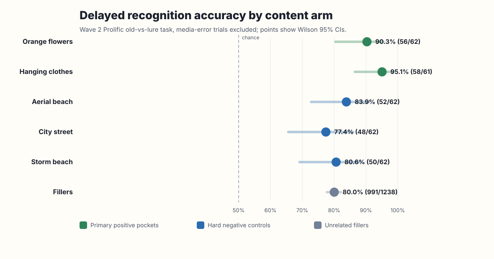
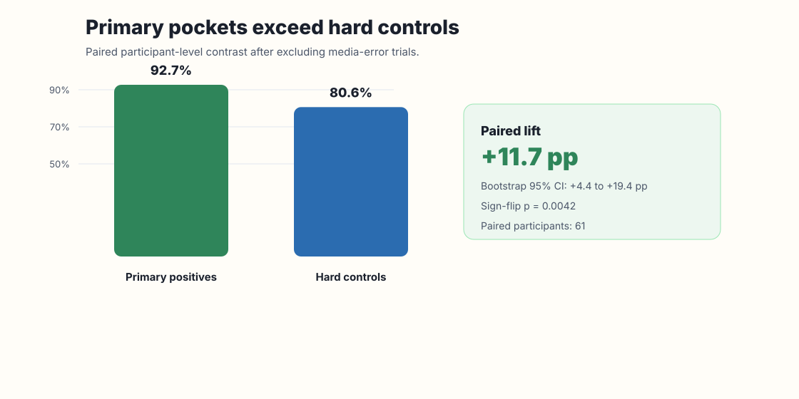
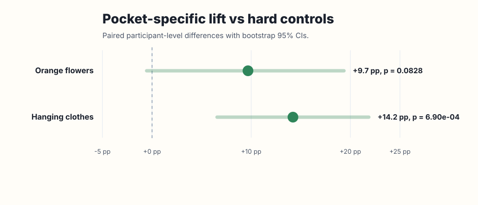

# Content-Pocket Recognition-Memory Wave 2 Result

Date: 2026-06-12T16:31:29.718114+00:00

## Status

- Status: `human_recognition_wave2_analyzed`
- Claim level: narrow delayed human old-vs-lure recognition evidence.
- Not claimed: broad human memorability, measured-BMD validation, or prompt-conditioned generation control.

## Figures

## Data Integrity

- Prolific Wave 2 rows: 64.
- Prolific statuses: `{'APPROVED': 60, 'AWAITING REVIEW': 2, 'TIMED-OUT': 2}`.
- Complete matched Wave 2 webhook payloads: 62.
- Timed-out submissions without complete webhook payloads: 2.
- Visible Wave 1 payload subset: 24; overlap with complete Wave 2: 21; form mismatches in overlap: 0.

The Wave 1 webhook inbox was capped before the paid upgrade, so the full Wave 1 JSON payload set is not available. The recognition result therefore relies on Prolific-confirmed Wave 1 completion plus deterministic form assignment, with the visible Wave 1 subset used as a provenance check.

## Primary Recognition Results

| Group | Correct / n | Accuracy | Wilson 95% CI | p vs 0.5 | Media errors |
|---|---:|---:|---:|---:|---:|
| primary_positive | 114/123 | 0.927 | [0.867, 0.961] | 2.68e-24 | 0 |
| hard_negative_control | 150/186 | 0.806 | [0.744, 0.857] | 9.63e-18 | 0 |
| unrelated_filler | 991/1238 | 0.800 | [0.777, 0.822] | 7.69e-106 | 0 |
| arm:orange_flowers | 56/62 | 0.903 | [0.805, 0.955] | 2.97e-11 | 0 |
| arm:hanging_clothes | 58/61 | 0.951 | [0.865, 0.983] | 3.29e-14 | 0 |
| arm:aerial_beach | 52/62 | 0.839 | [0.728, 0.910] | 5.71e-08 | 0 |
| arm:city_street | 48/62 | 0.774 | [0.656, 0.860] | 1.74e-05 | 0 |
| arm:storm_beach | 50/62 | 0.806 | [0.691, 0.886] | 1.21e-06 | 0 |

## Paired Positive-Vs-Hard-Negative Contrast

- Primary analysis excludes trials with media-error flags.
- Complete paired participants: 61.
- Mean primary-positive minus hard-negative accuracy difference: 0.117.
- Bootstrap 95% CI: [0.044, 0.194].
- Sign-flip permutation p-value: 0.00425.

All-trial sensitivity:

- Complete paired participants: 62.
- Mean difference: 0.121.
- Bootstrap 95% CI: [0.046, 0.199].
- Sign-flip permutation p-value: 0.00287.

## Individual Pocket Contrasts

| Pocket | Mean lift vs hard controls | Bootstrap 95% CI | Sign-flip p | Participants |
|---|---:|---:|---:|---:|
| orange flowers | +9.7 pp | [-0.5, +19.4] pp | 0.08285 | 62 |
| hanging clothes | +14.2 pp | [+6.6, +21.9] pp | 0.00069 | 61 |

## Claim Boundary

This wave supports a narrow human recognition-memory claim for the primary content-pocket pair. Hanging clothes is individually robust; orange flowers is high in absolute recognition but weaker as a standalone contrast against the hard-negative pool. Because the original full analysis plan named a larger minimum usable sample, this result should be written as a strong Wave 2 human-validation draft result rather than as the final large-sample confirmation.
